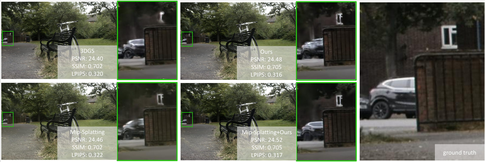

<p align="center">

  <h1 align="center">Projecting Gaussian Ellipsoids While Avoiding Affine Projection Approximation</h1>
  <p align="center">
    Han Qi
    ·
    Tao Cai
    ·
    Xiyue Han</p>
  <p align="center">Arxiv preprint</p>

  <p align="center">
  <a href="https://arxiv.org/abs/2411.07579">Paper</a> </p>
  <div align="center"></div>
</p>


<p align="center">
  <a href="">
    
  </a>
</p>

We propose an ellipsoid-based projection method to replace the Jacobian of the affine approximation of the projection
transformation in 3DGS. Our ellipsoid-based projection method can be applied to any 3DGS-based work to enhance rendering quality.
<br>


# Installation
The hardware and software requirements are the same as those of the 3D Gaussian Splatting, which this code is built upon. To setup the environment, please run the following command:
```
git clone https://github.com/KevinQi-1029/ellipsoid-based-projection.git
cd ellipsoid-based-projection
conda env create --file environment.yml
conda activate ebp
```

# Dataset

The MipNeRF360 scenes are provided by the paper's author and can be accessed [here](https://jonbarron.info/mipnerf360/). The SfM datasets for Tanks & Temples and Deep Blending are hosted by 3D-Gaussian-Splatting and are available for download [here](https://repo-sam.inria.fr/fungraph/3d-gaussian-splatting/datasets/input/tandt_db.zip). Other preprocessed Tanks & Temples scenes can be accessed [here](https://huggingface.co/datasets/ZehaoYu/gaussian-opacity-fields/tree/main).


# Running
Running code is similar to the [3D Gaussian Splatting](https://github.com/graphdeco-inria/gaussian-splatting).

# Citation
If you find our code or paper useful, please cite
```bibtex
@misc{qi2024projectinggaussianellipsoidsavoiding,
      title={Projecting Gaussian Ellipsoids While Avoiding Affine Projection Approximation}, 
      author={Han Qi and Tao Cai and Xiyue Han},
      year={2024},
      eprint={2411.07579},
      archivePrefix={arXiv},
      primaryClass={cs.CV},
      url={https://arxiv.org/abs/2411.07579}, 
}
```